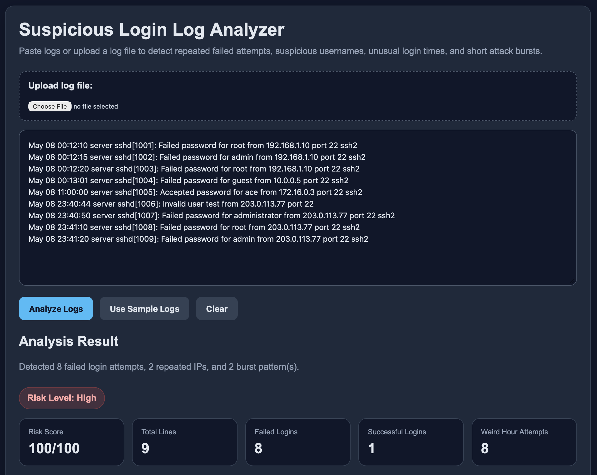
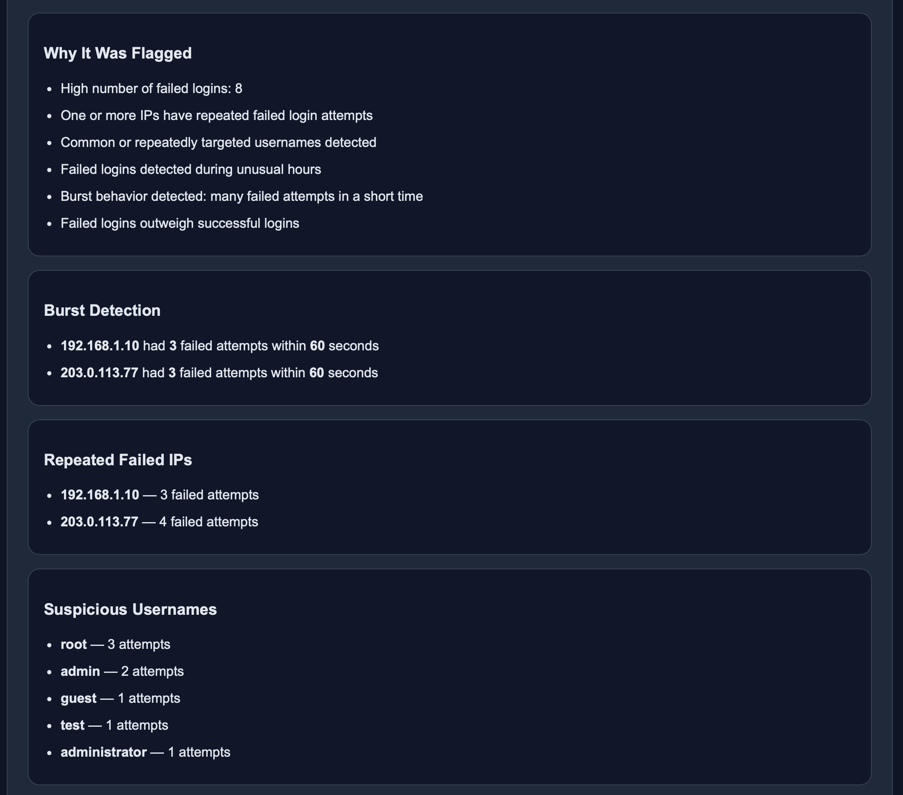
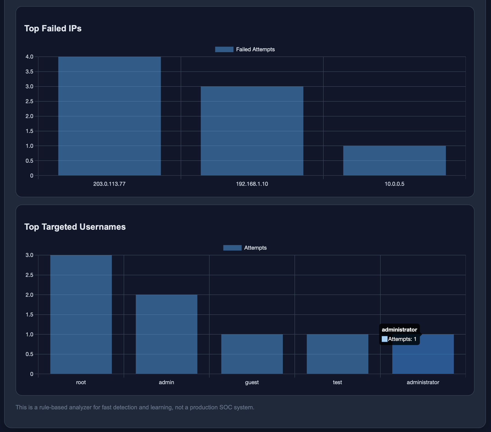

# Suspicious Login Log Analyzer

A Flask web app that analyzes authentication logs and flags suspicious patterns such as repeated failed logins, burst behavior, unusual login times, and targeted admin-style usernames.

## Features
- Paste logs or upload log files
- Detect repeated failed login attempts
- Flag suspicious usernames
- Detect unusual login hours
- Detect burst behavior in short time windows
- Visualize top failed IPs and usernames

## Tech Stack
- Python
- Flask
- Chart.js
- HTML/CSS

## Screenshots

### Main UI


### Analysis Results


### Visualization


## Live Demo

[Try the app](https://suspicious-login-log-analyzer.onrender.com)

## Run locally

```bash
python3 -m venv venv
source venv/bin/activate
pip install -r requirements.txt
python app.py

